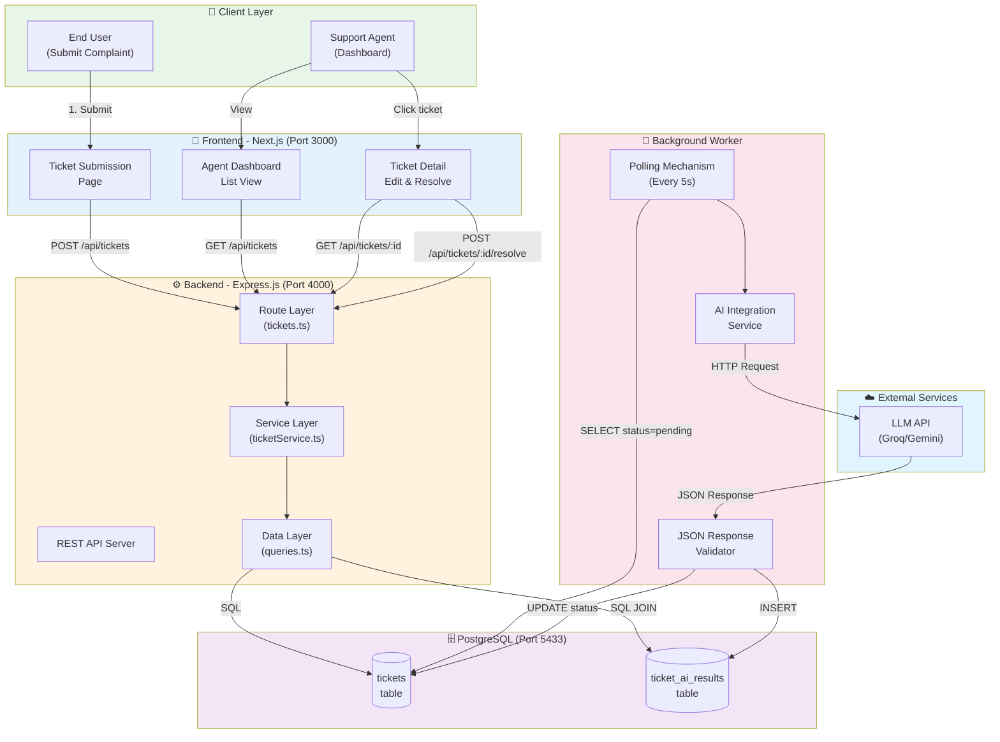

# Kiros AI Support Triage & Recovery Hub

> **Full Stack Technical Assessment Submission**  
> An AI-powered system that ingests user complaints and asynchronously turns them into prioritized, "ready-to-send" drafts.


## 🏗️ System Architecture

This project implements **Option A: The AI Support "Triage & Recovery" Hub** using a decoupled architecture to ensure high performance and scalability.

### High-Level Architecture Diagram



### 🚀 Handling the "Bottle-Neck" Constraint

> _Constraint: The AI processing (which takes 3-5 seconds) must not block the HTTP response._

I implemented an **Asynchronous Worker Pattern**:

1.  **Ingestion**: `POST /tickets` validates input, saves to DB with status `pending`, and immediately returns `201 Created`. Time taken: < 50ms.
2.  **Processing**: A separate Worker process polls the DB for `pending` tickets (every 5s).
3.  **AI Analysis**: The Worker sends content to Groq API to categorize, score urgency, and draft replies.
4.  **Update**: Results are saved to DB with status `processed`. The Frontend dashboard auto-refreshes to show the update.

This ensures the user **never waits** for the AI.

---

## 🛠️ Tech Stack

- **Frontend**: Next.js 16, React 19, TypeScript, shadcn/ui, Tailwind CSS.
- **Backend**: Node.js, Express, TypeScript.
- **Database**: PostgreSQL 15 (Docker).
- **AI**: Groq API (Model: `llama-3.3-70b-versatile`).
- **DevOps**: Docker Compose, Nodemon.

---

## 📚 API Documentation

Base URL: `http://localhost:4000/api`

### Endpoints Overview

| Method | Endpoint                 | Description                          | Auth Required |
| :----- | :----------------------- | :----------------------------------- | :------------ |
| `POST` | **/tickets**             | Submit a new ticket (Async)          | No            |
| `GET`  | **/tickets**             | List tickets (Pagination, Filtering) | No            |
| `GET`  | **/tickets/:id**         | Get ticket details + AI Analysis     | No            |
| `POST` | **/tickets/:id/resolve** | Resolve a ticket                     | No            |

### 1. Submit Ticket

```http
POST /tickets
Content-Type: application/json

{
  "email": "user@example.com",
  "content": "I was charged twice. Refund please!"
}
```

**Response (201 Created)**:

```json
{
  "success": true,
  "data": {
    "ticket_id": 1,
    "status": "pending",
    "message": "Ticket submitted successfully. Our AI is analyzing your request."
  }
}
```

### 2. List Tickets

```http
GET /tickets?page=1&limit=10&status=processed&urgency=high
```

**Response (200 OK)**:

```json
{
  "success": true,
  "data": {
    "tickets": [ ... ],
    "pagination": { "page": 1, "limit": 10, "total_count": 50 }
  }
}
```

---

## 🚦 Setup Instructions

### Prerequisites

- Node.js 18+
- Docker & Docker Compose
- Valid [Groq API Key](https://console.groq.com/keys)

### 1. Environment Setup

**Backend**:

```bash
cd backend
cp .env.example .env
# Edit .env and add your LLM_API_KEY
```

**Frontend**:

```bash
cd frontend
cp .env.example .env.local
```

### 2. Start Database

```bash
docker-compose up -d
```

_This starts PostgreSQL on port 5433._

### 3. Start Backend & Worker

Open a terminal:

```bash
cd backend
npm install
npm run dev     # Starts API Server on port 4000
```

Open a **separate** terminal for the Worker:

```bash
cd backend
npm run worker  # Starts Background Worker
```

### 4. Start Frontend

Open a third terminal:

```bash
cd frontend
npm install
npm run dev     # Starts Next.js on port 3000
```

### 5. Verify

Visit `http://localhost:3000` to access the application.

---

## 🤖 AI Usage & Workflow

As per instructions, I utilized **Agentic AI** (Google DeepMind's Antigravity Agent) to accelerate development.

- **Boilerplate & Config**: The agent setup the monorepo structure, Docker Compose, and TypeScript config in minutes.
- **Debugging**: When `mixtral-8x7b` model threw 400 errors with JSON mode, the agent identified the issue and switched to `llama-3.3-70b-versatile` which supports structured JSON output natively.
- **Frontend UI**: Used shadcn/ui to rapidly build a professional dashboard without writing custom CSS from scratch.

---

## 🧪 Testing the Flow

1.  Go to `http://localhost:3000/submit` and submit a ticket:
    > "I was charged twice for the same order. Please refund immediately!"
2.  You will be redirected to the Dashboard `http://localhost:3000/dashboard`.
3.  Observe the ticket status is `pending` (Grey).
4.  Wait ~5-10 seconds. The dashboard will auto-refresh.
5.  Ticket status becomes `processed` (Green) with **High Urgency** (Red Badge).
6.  Click the ticket to view the AI-drafted reply and resolve it.

---

## 🎥 Video Walkthrough

[Link to Loom Video] _(To be updated by candidate)_
