# System Architecture Diagram (SAD)

## Kiros AI Support Triage & Recovery Hub

---

## High-Level System Architecture

---

## Detailed Component Architecture

```mermaid
graph LR
    subgraph FE["Frontend Components"]
        direction TB
        Form["Submission Form"]
        List["Ticket List"]
        Detail["Ticket Detail"]
    end

    subgraph BE["Backend Layers"]
        direction TB
        Routes["Routes<br/>(Express Router)"]
        Services["Business Logic<br/>(Validation)"]
        DataLayer["Database Queries<br/>(pg Pool)"]
    end

    subgraph DB["Database Schema"]
        direction TB
        T1["tickets<br/>├─ id<br/>├─ email<br/>├─ content<br/>└─ status"]
        T2["ticket_ai_results<br/>├─ ticket_id<br/>├─ category<br/>├─ urgency<br/>└─ draft_reply"]
    end

    FE -->|HTTP/JSON| Routes
    Routes --> Services
    Services --> DataLayer
    DataLayer -->|SQL| T1
    DataLayer -->|SQL| T2
    T2 -.->|FK| T1

    style FE fill:#42A5F5
    style BE fill:#66BB6A
    style DB fill:#AB47BC
```

---

## Data Flow: Ticket Submission (Async)

---

## Data Flow: Agent Dashboard View

```mermaid
sequenceDiagram
    participant A as 👨‍💼 Agent
    participant D as Dashboard
    participant API as Backend API
    participant DB as PostgreSQL

    A->>D: Open dashboard
    D->>API: GET /api/tickets?page=1
    API->>DB: SELECT tickets<br/>LEFT JOIN ticket_ai_results
    DB-->>API: [{ticket + ai_result}]
    API-->>D: JSON with urgency
    D->>D: Color-code by urgency
    D-->>A: Display list

    A->>D: Click ticket #1
    D->>API: GET /api/tickets/1
    API->>DB: SELECT WHERE id=1
    DB-->>API: Full ticket data
    API-->>D: {ticket + ai_result}
    D-->>A: Show detail view

    A->>D: Edit draft & click Resolve
    D->>API: POST /api/tickets/1/resolve<br/>{final_reply}
    API->>DB: UPDATE status='resolved'
    DB-->>API: Success
    API-->>D: 200 OK
    D-->>A: "Resolved!"
```

---

## Technology Stack Diagram

---

## Deployment Architecture

---

## Error Handling Flow

---

## Database ER Diagram

---

## Summary

**Architecture Pattern**: Layered + Async Worker Pattern

**Key Principles**:

- ✅ Non-blocking API (< 100ms response)
- ✅ Background processing (async AI)
- ✅ Separation of concerns (Routes → Services → Data)
- ✅ Robust error handling
- ✅ Type safety (TypeScript)

**Scalability Considerations**:

- Connection pooling for concurrent requests
- Polling can be replaced with job queue (BullMQ)
- Worker can scale horizontally
- Database can be replicated for read operations
