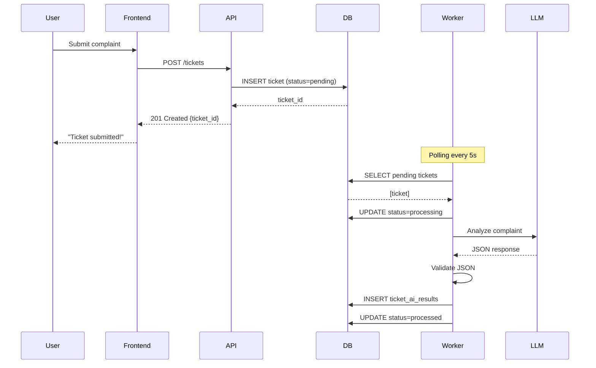
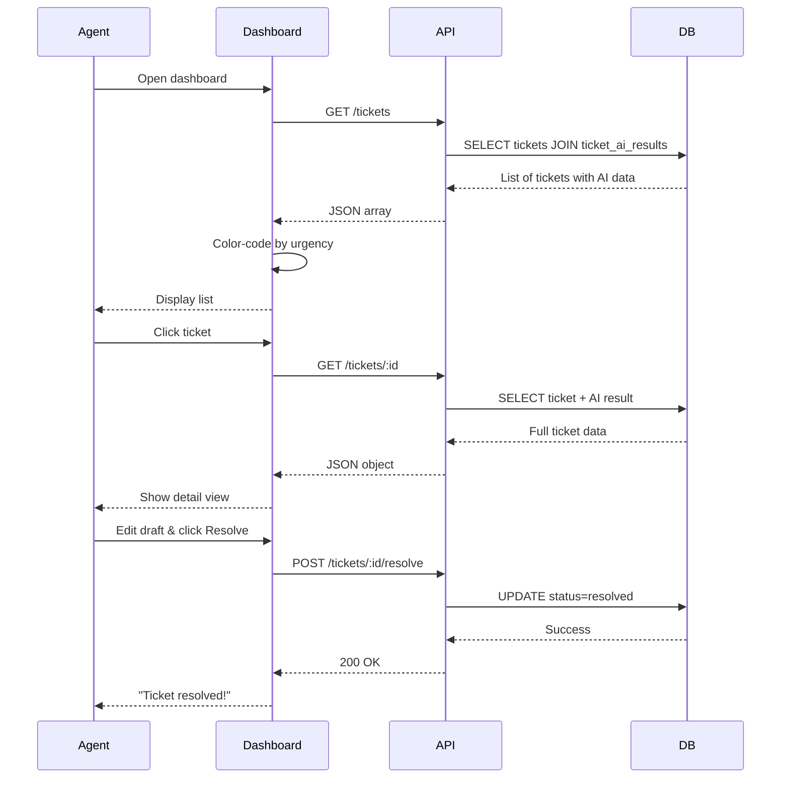
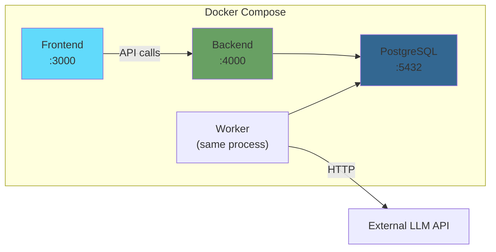

# System Architecture - AI Support Triage & Recovery Hub

## Overview

This document outlines the system architecture for the AI Support Triage & Recovery Hub, focusing on asynchronous processing, data flow, and component interactions.

---

## High-Level Architecture Diagram

```mermaid
graph TB
    subgraph "Client Layer"
        User["👤 End User"]
        Agent["👨‍💼 Support Agent"]
    end

    subgraph "Frontend - Next.js"
        SubmitForm["Ticket Submission Form"]
        Dashboard["Agent Dashboard"]
        DetailView["Ticket Detail View"]
    end

    subgraph "Backend - Express.js"
        API["REST API Server"]
        TicketAPI["POST /tickets"]
        ListAPI["GET /tickets"]
        DetailAPI["GET /tickets/:id"]
        ResolveAPI["POST /tickets/:id/resolve"]
    end

    subgraph "Background Processing"
        Worker["Background Worker"]
        JobQueue["Job Queue/Polling"]
    end

    subgraph "External Services"
        LLM["LLM API<br/>(Gemini/Groq/OpenRouter)"]
    end

    subgraph "Data Layer"
        DB[(PostgreSQL)]
        TicketsTable["tickets table"]
        AIResultsTable["ticket_ai_results table"]
    end

    User -->|Submit complaint| SubmitForm
    SubmitForm -->|POST /tickets| TicketAPI
    TicketAPI -->|1. Insert ticket<br/>status=pending| TicketsTable
    TicketAPI -->|2. Return 201 immediately| SubmitForm

    Worker -->|Poll for pending tickets| TicketsTable
    Worker -->|Call LLM with prompt| LLM
    LLM -->|Return JSON<br/>(category, sentiment,<br/>urgency, draft)| Worker
    Worker -->|Validate JSON| Worker
    Worker -->|Insert AI results| AIResultsTable
    Worker -->|Update status| TicketsTable

    Agent -->|View tickets| Dashboard
    Dashboard -->|GET /tickets| ListAPI
    ListAPI -->|JOIN tickets + AI results| DB
    ListAPI -->|Return list with urgency| Dashboard

    Agent -->|Click ticket| DetailView
    DetailView -->|GET /tickets/:id| DetailAPI
    DetailAPI -->|Fetch ticket + AI result| DB
    DetailAPI -->|Return full details| DetailView

    Agent -->|Edit draft & resolve| DetailView
    DetailView -->|POST /tickets/:id/resolve| ResolveAPI
    ResolveAPI -->|Update status=resolved| TicketsTable

    style TicketAPI fill:#90EE90
    style Worker fill:#FFB6C1
    style LLM fill:#87CEEB
    style DB fill:#DDA0DD
```

---

## Component Details

### 1. Frontend (Next.js)

**Technology**: Next.js 14+ with App Router, TypeScript, Tailwind CSS

**Pages/Components**:

- **Ticket Submission Form** (`/submit`)
  - Input fields: email (optional), complaint text
  - Submit button → POST /tickets
  - Show success message with ticket ID
- **Agent Dashboard** (`/dashboard`)
  - List view with color-coded urgency
  - Filters by status, category, urgency
  - Click to navigate to detail view
- **Ticket Detail View** (`/dashboard/[id]`)
  - Display all ticket info + AI analysis
  - Editable draft reply textarea
  - "Resolve" button

---

### 2. Backend (Express.js + Node.js)

**Technology**: Express.js, TypeScript, node-postgres (pg)

**API Endpoints**:

| Method | Endpoint               | Description                      | Response Time   |
| ------ | ---------------------- | -------------------------------- | --------------- |
| POST   | `/tickets`             | Create new ticket                | < 100ms (async) |
| GET    | `/tickets`             | List all tickets with AI results | < 500ms         |
| GET    | `/tickets/:id`         | Get single ticket details        | < 200ms         |
| POST   | `/tickets/:id/resolve` | Mark ticket as resolved          | < 200ms         |

**Key Implementation Details**:

- **POST /tickets**:
  - Validate input
  - Insert into `tickets` table with `status=pending`
  - **DO NOT WAIT** for AI processing
  - Return `201 Created` with ticket ID immediately
  - Background worker picks up the job

---

### 3. Background Worker

**Implementation Options**:

#### Option A: Simple Polling (Recommended for MVP)

```javascript
// Runs every 5 seconds
setInterval(async () => {
  const pendingTickets = await db.query(
    "SELECT * FROM tickets WHERE status = 'pending' LIMIT 10",
  );

  for (const ticket of pendingTickets) {
    await processTicketWithAI(ticket);
  }
}, 5000);
```

**Pros**: Simple, no external dependencies  
**Cons**: Not real-time, polling overhead

#### Option B: Job Queue (Bull/BullMQ)

- Use Redis-backed queue
- More scalable and production-ready
- Requires Redis setup

**For this assessment, Option A is sufficient** to demonstrate async processing.

---

### 4. LLM Integration

**Provider Options** (free/low-cost):

- **Gemini API** (Google) - Free tier available
- **Groq** - Fast inference, free tier
- **OpenRouter** - Multiple models, pay-per-use

**Prompt Engineering**:

```javascript
const prompt = `
You are a customer support AI assistant. Analyze the following complaint and return a JSON response.

Complaint: "${ticket.content}"

Return ONLY valid JSON in this exact format:
{
  "category": "billing" | "technical" | "feature_request",
  "sentiment_score": 1-10,
  "urgency": "high" | "medium" | "low",
  "draft_reply": "A polite, context-aware response"
}
`;
```

**JSON Validation**:

```javascript
const schema = {
  category: ["billing", "technical", "feature_request"],
  sentiment_score: (val) => val >= 1 && val <= 10,
  urgency: ["high", "medium", "low"],
  draft_reply: (val) => typeof val === "string" && val.length > 0,
};
```

---

### 5. Database (PostgreSQL)

**Schema** (detailed in separate document):

- `tickets` - stores user complaints
- `ticket_ai_results` - stores AI analysis results

**Key Design Decisions**:

- Separate tables for normalization
- Use ENUMs for category/urgency
- Indexes on `status` and `created_at` for worker queries

---

## Data Flow Sequence

### Sequence 1: Ticket Submission (Async)



### Sequence 2: Agent Dashboard View



---

## Edge Cases & Error Handling

### 1. LLM Returns Invalid JSON

**Problem**: AI returns malformed JSON or missing fields  
**Solution**:

```javascript
try {
  const result = JSON.parse(llmResponse);
  validateSchema(result); // Throws if invalid
  await saveAIResult(result);
} catch (error) {
  console.error("Invalid AI response:", error);
  // Retry with more explicit prompt, or mark as failed
  await db.query("UPDATE tickets SET status = 'ai_failed' WHERE id = $1", [
    ticketId,
  ]);
}
```

### 2. LLM API Timeout/Failure

**Problem**: LLM API is down or slow  
**Solution**:

- Implement retry logic (max 3 retries with exponential backoff)
- Set timeout (e.g., 30 seconds)
- Mark ticket as `ai_failed` after retries exhausted
- Allow manual agent processing

### 3. Database Connection Issues

**Problem**: DB connection pool exhausted  
**Solution**:

- Use connection pooling (pg.Pool)
- Set max connections limit
- Graceful error handling with 500 response

### 4. Worker Crashes

**Problem**: Worker process dies mid-processing  
**Solution**:

- Use `status=processing` to track in-progress tickets
- On worker restart, reset stuck tickets:
  ```sql
  UPDATE tickets
  SET status = 'pending'
  WHERE status = 'processing'
    AND updated_at < NOW() - INTERVAL '5 minutes';
  ```

### 5. Duplicate Ticket Submissions

**Problem**: User clicks submit multiple times  
**Solution**:

- Frontend: Disable submit button after click
- Backend: Optional - check for duplicate content within 1 minute from same email

---

## Performance Considerations

| Metric                      | Target           | Strategy                               |
| --------------------------- | ---------------- | -------------------------------------- |
| POST /tickets response time | < 100ms          | No AI blocking, immediate DB insert    |
| GET /tickets response time  | < 500ms          | Indexed queries, pagination            |
| Worker processing time      | < 10s per ticket | Timeout LLM calls, parallel processing |
| Concurrent tickets          | 100+             | Connection pooling, worker scaling     |

---

## Deployment Architecture (Local Development)



**docker-compose.yml** will include:

- `frontend` service (Next.js dev server)
- `backend` service (Express + Worker in same process)
- `postgres` service with volume persistence

---

## Security Considerations

1. **Input Validation**: Sanitize user input to prevent SQL injection
2. **Rate Limiting**: Prevent spam submissions (e.g., 10 tickets/hour per IP)
3. **API Key Security**: Store LLM API keys in environment variables
4. **CORS**: Configure proper CORS for frontend-backend communication
5. **SQL Injection**: Use parameterized queries (pg library handles this)

---

## Next Steps

1. ✅ Architecture designed
2. → Design database schema (ERD)
3. → Write API specification (OpenAPI format)
4. → Create implementation plan with timeline
