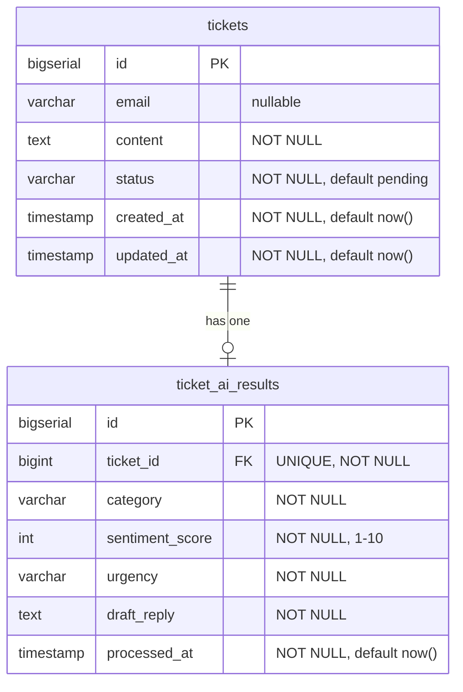

# Database Schema - AI Support Triage & Recovery Hub

## Entity Relationship Diagram



---

## Table Definitions

### 1. `tickets`

Stores user-submitted complaints/tickets.

```sql
CREATE TYPE ticket_status AS ENUM ('pending', 'processing', 'processed', 'resolved', 'ai_failed');

CREATE TABLE tickets (
    id BIGSERIAL PRIMARY KEY,
    email VARCHAR(255),
    content TEXT NOT NULL,
    status ticket_status NOT NULL DEFAULT 'pending',
    created_at TIMESTAMP NOT NULL DEFAULT NOW(),
    updated_at TIMESTAMP NOT NULL DEFAULT NOW()
);

-- Indexes for performance
CREATE INDEX idx_tickets_status ON tickets(status);
CREATE INDEX idx_tickets_created_at ON tickets(created_at DESC);
CREATE INDEX idx_tickets_status_created ON tickets(status, created_at DESC);
```

**Field Descriptions**:

| Field        | Type         | Constraints                 | Description                 |
| ------------ | ------------ | --------------------------- | --------------------------- |
| `id`         | BIGSERIAL    | PRIMARY KEY                 | Auto-incrementing ticket ID |
| `email`      | VARCHAR(255) | NULLABLE                    | Optional user email         |
| `content`    | TEXT         | NOT NULL                    | The complaint text          |
| `status`     | ENUM         | NOT NULL, DEFAULT 'pending' | Current processing status   |
| `created_at` | TIMESTAMP    | NOT NULL, DEFAULT NOW()     | When ticket was created     |
| `updated_at` | TIMESTAMP    | NOT NULL, DEFAULT NOW()     | Last update timestamp       |

**Status Values**:

- `pending` - Newly created, waiting for AI processing
- `processing` - Currently being processed by worker
- `processed` - AI analysis complete
- `resolved` - Agent has resolved the ticket
- `ai_failed` - AI processing failed (for manual handling)

---

### 2. `ticket_ai_results`

Stores AI analysis results for each ticket.

```sql
CREATE TYPE ticket_category AS ENUM ('billing', 'technical', 'feature_request');
CREATE TYPE ticket_urgency AS ENUM ('high', 'medium', 'low');

CREATE TABLE ticket_ai_results (
    id BIGSERIAL PRIMARY KEY,
    ticket_id BIGINT NOT NULL UNIQUE,
    category ticket_category NOT NULL,
    sentiment_score INT NOT NULL CHECK (sentiment_score >= 1 AND sentiment_score <= 10),
    urgency ticket_urgency NOT NULL,
    draft_reply TEXT NOT NULL,
    processed_at TIMESTAMP NOT NULL DEFAULT NOW(),
    FOREIGN KEY (ticket_id) REFERENCES tickets(id) ON DELETE CASCADE
);

-- Index for JOIN performance
CREATE INDEX idx_ticket_ai_results_ticket_id ON ticket_ai_results(ticket_id);
```

**Field Descriptions**:

| Field             | Type      | Constraints             | Description                  |
| ----------------- | --------- | ----------------------- | ---------------------------- |
| `id`              | BIGSERIAL | PRIMARY KEY             | Auto-incrementing result ID  |
| `ticket_id`       | BIGINT    | FK, UNIQUE, NOT NULL    | Reference to tickets table   |
| `category`        | ENUM      | NOT NULL                | AI-determined category       |
| `sentiment_score` | INT       | NOT NULL, CHECK 1-10    | Sentiment score from AI      |
| `urgency`         | ENUM      | NOT NULL                | AI-determined urgency level  |
| `draft_reply`     | TEXT      | NOT NULL                | AI-generated draft response  |
| `processed_at`    | TIMESTAMP | NOT NULL, DEFAULT NOW() | When AI processing completed |

**Category Values**: `billing`, `technical`, `feature_request`  
**Urgency Values**: `high`, `medium`, `low`

---

## Migration Scripts

### Migration 1: Initial Schema

**File**: `migrations/001_initial_schema.sql`

```sql
-- Create ENUM types
CREATE TYPE ticket_status AS ENUM ('pending', 'processing', 'processed', 'resolved', 'ai_failed');
CREATE TYPE ticket_category AS ENUM ('billing', 'technical', 'feature_request');
CREATE TYPE ticket_urgency AS ENUM ('high', 'medium', 'low');

-- Create tickets table
CREATE TABLE tickets (
    id BIGSERIAL PRIMARY KEY,
    email VARCHAR(255),
    content TEXT NOT NULL,
    status ticket_status NOT NULL DEFAULT 'pending',
    created_at TIMESTAMP NOT NULL DEFAULT NOW(),
    updated_at TIMESTAMP NOT NULL DEFAULT NOW()
);

-- Create ticket_ai_results table
CREATE TABLE ticket_ai_results (
    id BIGSERIAL PRIMARY KEY,
    ticket_id BIGINT NOT NULL UNIQUE,
    category ticket_category NOT NULL,
    sentiment_score INT NOT NULL CHECK (sentiment_score >= 1 AND sentiment_score <= 10),
    urgency ticket_urgency NOT NULL,
    draft_reply TEXT NOT NULL,
    processed_at TIMESTAMP NOT NULL DEFAULT NOW(),
    FOREIGN KEY (ticket_id) REFERENCES tickets(id) ON DELETE CASCADE
);

-- Create indexes
CREATE INDEX idx_tickets_status ON tickets(status);
CREATE INDEX idx_tickets_created_at ON tickets(created_at DESC);
CREATE INDEX idx_tickets_status_created ON tickets(status, created_at DESC);
CREATE INDEX idx_ticket_ai_results_ticket_id ON ticket_ai_results(ticket_id);

-- Create updated_at trigger function
CREATE OR REPLACE FUNCTION update_updated_at_column()
RETURNS TRIGGER AS $$
BEGIN
    NEW.updated_at = NOW();
    RETURN NEW;
END;
$$ LANGUAGE plpgsql;

-- Apply trigger to tickets table
CREATE TRIGGER update_tickets_updated_at
    BEFORE UPDATE ON tickets
    FOR EACH ROW
    EXECUTE FUNCTION update_updated_at_column();
```

### Rollback Script

**File**: `migrations/001_rollback.sql`

```sql
DROP TRIGGER IF EXISTS update_tickets_updated_at ON tickets;
DROP FUNCTION IF EXISTS update_updated_at_column();
DROP TABLE IF EXISTS ticket_ai_results;
DROP TABLE IF EXISTS tickets;
DROP TYPE IF EXISTS ticket_urgency;
DROP TYPE IF EXISTS ticket_category;
DROP TYPE IF EXISTS ticket_status;
```

---

## Sample Queries

### 1. Worker: Fetch Pending Tickets

```sql
SELECT id, email, content, created_at
FROM tickets
WHERE status = 'pending'
ORDER BY created_at ASC
LIMIT 10;
```

### 2. Worker: Update Ticket Status to Processing

```sql
UPDATE tickets
SET status = 'processing'
WHERE id = $1;
```

### 3. Worker: Insert AI Results

```sql
INSERT INTO ticket_ai_results (
    ticket_id,
    category,
    sentiment_score,
    urgency,
    draft_reply
) VALUES ($1, $2, $3, $4, $5)
RETURNING id;
```

### 4. Worker: Mark Ticket as Processed

```sql
UPDATE tickets
SET status = 'processed'
WHERE id = $1;
```

### 5. API: Get All Tickets with AI Results (Dashboard List)

```sql
SELECT
    t.id,
    t.email,
    t.content,
    t.status,
    t.created_at,
    t.updated_at,
    r.category,
    r.sentiment_score,
    r.urgency,
    r.draft_reply,
    r.processed_at
FROM tickets t
LEFT JOIN ticket_ai_results r ON t.id = r.ticket_id
ORDER BY t.created_at DESC
LIMIT 50 OFFSET $1;
```

### 6. API: Get Single Ticket Details

```sql
SELECT
    t.id,
    t.email,
    t.content,
    t.status,
    t.created_at,
    t.updated_at,
    r.category,
    r.sentiment_score,
    r.urgency,
    r.draft_reply,
    r.processed_at
FROM tickets t
LEFT JOIN ticket_ai_results r ON t.id = r.ticket_id
WHERE t.id = $1;
```

### 7. API: Resolve Ticket

```sql
UPDATE tickets
SET status = 'resolved'
WHERE id = $1
RETURNING *;
```

### 8. Worker: Reset Stuck Processing Tickets (on restart)

```sql
UPDATE tickets
SET status = 'pending'
WHERE status = 'processing'
  AND updated_at < NOW() - INTERVAL '5 minutes';
```

---

## Data Examples

### Sample Ticket

```json
{
  "id": 1,
  "email": "user@example.com",
  "content": "I was charged twice for my subscription this month. Please refund the duplicate charge.",
  "status": "processed",
  "created_at": "2026-02-06T10:30:00Z",
  "updated_at": "2026-02-06T10:30:15Z"
}
```

### Sample AI Result

```json
{
  "id": 1,
  "ticket_id": 1,
  "category": "billing",
  "sentiment_score": 7,
  "urgency": "high",
  "draft_reply": "Dear valued customer,\n\nThank you for bringing this to our attention. I sincerely apologize for the duplicate charge on your subscription. I've escalated this to our billing team, and you should see the refund processed within 3-5 business days.\n\nIf you have any questions, please don't hesitate to reach out.\n\nBest regards,\nSupport Team",
  "processed_at": "2026-02-06T10:30:15Z"
}
```

---

## Design Decisions

### 1. Why Separate Tables?

**Normalization**: Keeps ticket data separate from AI analysis results. This allows:

- Tickets to exist before AI processing
- Easy handling of AI failures (no AI result row)
- Clear data ownership and lifecycle

### 2. Why ENUM Types?

**Data Integrity**: PostgreSQL ENUMs ensure:

- Only valid values can be inserted
- Type-safe queries
- Better performance than VARCHAR with CHECK constraints
- Self-documenting schema

### 3. Why UNIQUE Constraint on ticket_id?

**One-to-One Relationship**: Each ticket should have exactly one AI analysis result. The UNIQUE constraint enforces this at the database level.

### 4. Why ON DELETE CASCADE?

**Data Consistency**: If a ticket is deleted (rare in production, but useful for testing), the AI result should also be deleted to avoid orphaned records.

### 5. Why Indexes on status and created_at?

**Query Performance**:

- Worker frequently queries `WHERE status = 'pending'`
- Dashboard queries `ORDER BY created_at DESC`
- Composite index `(status, created_at)` optimizes both

---

## Performance Considerations

| Operation                | Expected Frequency         | Optimization                           |
| ------------------------ | -------------------------- | -------------------------------------- |
| Insert ticket            | High (user submissions)    | Auto-increment PK, minimal constraints |
| Query pending tickets    | Every 5s (worker poll)     | Index on `status`                      |
| Insert AI results        | Medium (worker processing) | FK index on `ticket_id`                |
| List tickets (dashboard) | Medium (agent views)       | Composite index, LIMIT clause          |
| Update ticket status     | High (worker + agent)      | Indexed PK lookup                      |

**Estimated Capacity**:

- 10,000 tickets/day = ~7 tickets/minute
- Worker polling every 5s can handle 100+ tickets/minute
- Database can handle 1M+ tickets with proper indexing

---

## Next Steps

1. ✅ Database schema designed
2. → Write API specification
3. → Create implementation plan
